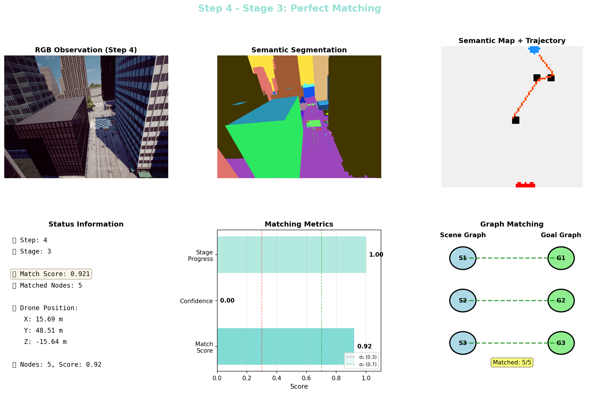
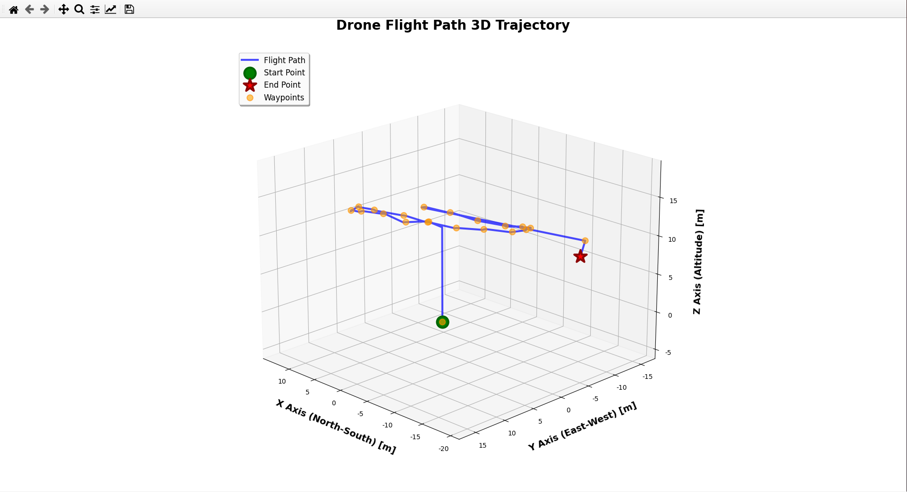

# AGoal

**零样本目标导向的无人机自主导航系统**（AirSim 仿真）

给无人机一张**目标图片**，或者一句**语言指令**，它就在完全陌生、从未建过图的城区里自己找过去——
不需要任何针对该场景的训练或微调。

```
输入: 一张"红车旁的白色建筑"照片  →  无人机起飞、巡航、比对、确认、飞抵
输入: "Find the car"              →  无人机查地图、飞过去、用视觉复核
```
---
## 效果展示

## 效果展示

## 效果展示

### 导航演示
<table>
  <col width="25%">
  <col width="75%">
  <tr>
    <td align="center" valign="middle">
      <strong>🎯 语言目标</strong>
      <br><br>
      找到一个深黑色大楼，左侧有白色网格状外墙的大楼，右侧是灰白色的建筑，底部有街道和黄色小车
      <br><br>
      
      <br>
      <small>目标参考图</small>
    </td>
    <td align="center" valign="middle">
      
      <br>
      <small>陌生场景自主导航抵达目标</small>
    </td>
  </tr>
</table>

### 核心能力可视化
| 推理过程可视化 | 飞行轨迹 |
|:---:|:---:|
|  |  |
| 实时语义图构建与匹配评分 | 全局路径规划与动态避障 |


---

## 目录

- [核心思路](#核心思路)
- [效果与输出](#效果与输出)
- [仓库结构](#仓库结构)
- [环境准备](#环境准备)
- [快速开始](#快速开始)
- [三种运行方式](#三种运行方式)
- [配置说明](#配置说明)
- [模型与数据下载](#模型与数据下载)
- [常见问题](#常见问题)

---

## 核心思路

系统把"寻找目标"这件事拆成**两张图的匹配问题**：一张从目标描述里抽出来的
**目标图 G_g**，一张从当前观测里实时长出来的**场景图 G_t**。导航过程就是不断缩小两张图差距的过程。

```
                       ┌──────────────── 目标侧（一次性）────────────────┐
   目标图片 ──▶ GroundingDINO 检测 ──▶ SAM 分割 ──▶ CLIP 特征
                                                      │
                                          构建目标图 G_g
                                    （节点=物体，边=空间关系，
                                      面积最大的物体为中心节点）
                       └───────────────────────────────────────────────┘

                       ┌──────────────── 观测侧（每一步）────────────────┐
   AirSim RGB + 分割 + 深度 + LiDAR
              │                                    │
              ├──▶ GroundingDINO + SAM ──▶ 场景图 G_t
              │                                    │
              └──▶ STMR 俯视语义栅格（增量累积）      │
                       └───────────────────┬───────────────────────────┘
                                           ▼
                              图匹配：score(G_t, G_g)
                                           │
        ┌──────────────────────────────────┼──────────────────────────────────┐
        ▼                                  ▼                                  ▼
  score < 0.3                      0.3 ≤ score < 0.7                   score ≥ 0.7
  ───────────                      ────────────────                    ───────────
  阶段1 零匹配                      阶段2 部分匹配                       阶段3 完全匹配
  选语义前沿点                      用已匹配的子结构                     锁定中心节点坐标
  扩大探索范围                      推断目标方位并前往                   LiDAR 避障接近 + 复核
```

三个阶段共用同一套评分，只是阈值不同，切换是平滑的，没有硬编码的状态机跳转。

### 关键模块

| 模块 | 作用 |
|---|---|
| `src/mapping/stmr_builder.py` | **STMR**（Semantic Top-down Map Representation）。把 AirSim 分割图按相机投影摊到俯视栅格上，增量累积成语义地图，并输出局部矩阵供 LLM 读取 |
| `src/graph/` | 场景图 / 目标图的构建、校正与匹配。含图核相似度、3D IoU、CLIP 外观相似度 |
| `src/envs/airsim_env.py` | AirSim 多旋翼环境封装，对外提供类 Habitat 的 `reset()` / `get_observation()` 接口 |
| `src/navigation/dstar_lite.py` | D* Lite 增量重规划，栅格代价变化时不必从头算 |
| `src/planning/path_planner.py` | 带安全膨胀距离的 A* 全局路径规划 |
| `src/detectors/yolo_detector.py` | YOLOv8 实时检测 + 深度图反投影，用于文本目标链路的视觉复核 |
| `src/visualization/navigation_visualizer.py` | 每一步拼一张状态面板（RGB / 分割 / 语义地图 / 匹配分 / 置信度），可合成视频 |

---

## 效果与输出

一次 `run_image_goal.py` 运行会在仓库根目录产出：

```
outputs/visualization/step_001.png ...   每步状态面板（可直接拼成汇报图/视频）
maps/semantic_hq_step_N.png              每 5 步的高质量语义地图
maps/stmr_step_N.png                     每 10 步的 STMR 栅格
maps/matrix_step_N.png                   每 10 步的局部语义矩阵
outputs/visualization/navigation_full.mp4  导航全过程视频（2 fps，同目录下）
```

`build_offline_map.py` 产出的 `.pkl` 语义地图包含 `semantic_map`、`occupancy_grid`、
`objects`（含 LLM 生成的描述）、`map_size`、`resolution`、`metadata.coverage`，
可直接被文本目标链路加载复用。

---

## 仓库结构

```
AGoal/
├── run_image_goal.py          # 【主入口】图像目标导航：给一张图，飞过去
├── run_text_goal.py           # 【主入口】文本目标导航：预建地图 + YOLO 视觉复核
├── build_offline_map.py       # 【主入口】离线语义建图，产出 *.pkl
│
├── configs/
│   ├── config_airsim.yaml     # 在线导航参数（飞行高度、地图分辨率、LLM 接口）
│   ├── mapping_config.yaml    # 离线建图参数（相机内参、类别、聚类阈值）
│   └── categories.py          # 类别 id 映射
│
├── src/
│   ├── envs/airsim_env.py             # AirSim 环境封装
│   ├── detectors/yolo_detector.py     # YOLOv8 检测 + 3D 位置估计
│   ├── graph/                         # 场景图 / 目标图构建与匹配
│   │   ├── graph.py                   #   主流程：建图、匹配、三阶段调度
│   │   ├── graphbuilder.py            #   用 LLM 从检测结果抽关系
│   │   ├── goalgraphdecomposer.py     #   目标图分解
│   │   ├── overlap.py                 #   图核相似度匹配
│   │   ├── scenegraphcorrector.py     #   场景图校正与融合
│   │   └── utils/                     #   IoU、点云、映射工具
│   ├── mapping/
│   │   ├── stmr_builder.py            # STMR 俯视语义栅格
│   │   ├── semantic_map_optimizer.py  # 建图几何优化
│   │   └── map_post_processor.py      # 形态学后处理
│   ├── navigation/dstar_lite.py       # D* Lite
│   ├── planning/path_planner.py       # A*（带安全距离）
│   ├── map/bev_mapping.py             # BEV 地图维护
│   ├── semantic_graph/                # LLM 语义导航（独立分支）
│   │   ├── semantic_navigator.py
│   │   ├── llm_enricher.py
│   │   └── semantic_config.yaml
│   ├── visualization/navigation_visualizer.py
│   └── utils/                         # 相机内参、FMM 规划、LLM/VLM 封装、配置助手
│
├── scripts/
│   ├── download_models.sh / .ps1      # 拉取模型权重与第三方源码
│   ├── test_semantic_nav.py           # 在预建地图上跑语言指令导航
│   ├── fly_route.py                   # 航点飞行 + 3D 轨迹绘制
│   ├── probe_world_size.py            # 锁定曝光、探查场景边界
│   └── estimate_depth.py              # MiDaS 深度估计（可选）
│
├── requirements-core.txt      # 只跑图像目标主线的最小依赖
├── requirements.txt           # 全量依赖
├── LICENSE                    # MIT
└── .gitignore
```

> 室内 Habitat 相关模块（`src/agent/`、`src/world_model/`、Habitat 环境实现、HM3D 场景数据）
> 已从本仓库移除，如需室内版本请自行从上游获取。

---

## 环境准备

### 1. 基础环境

- Python **3.8 ~ 3.10**（GroundingDINO 编译在 3.11+ 上容易踩坑，建议 3.9）
- NVIDIA GPU + CUDA（8GB 显存可跑通；只用 ViT-B 的 SAM 时 6GB 也够）
- Windows 10/11 或 Ubuntu 20.04+

### 2. Python 依赖

```bash
# 先跑主线，装最小依赖
pip install -r requirements-core.txt

# 需要文本目标链路 / 离线建图时再装全量
pip install -r requirements.txt
```

### 3. AirSim 仿真器

AGoal 通过 Python 客户端连接 AirSim / Colosseum。微软的 AirSim 仓库已停止维护，
推荐直接使用社区接手的分支：

| 项目 | 地址 | 说明 |
|---|---|---|
| AirSim（原始，已归档） | https://github.com/microsoft/AirSim | 最后活跃版本，文档最全 |
| Colosseum | https://github.com/CodexLabsLLC/Colosseum | AirSim 的社区继任分支，支持新版 UE |

Python 客户端：`pip install airsim`（`requirements-core.txt` 已包含）。

### 4. AirSim settings.json

下面是一份**参考配置**，放在 `~/Documents/AirSim/settings.json`（Windows）或
`~/Documents/AirSim/settings.json`（Linux）。几个点必须和代码对上：

- 载具名 `Drone1`、`SimMode` 必须是 `Multirotor`
- 相机 `0`：图像目标链路和离线建图都从它取图，FOV 90°、640×480
- 相机 `front_center`：`src/envs/airsim_env.py` 用的是这个别名
- LiDAR `Lidar1`：阶段 3 接近目标时的避障依赖它

```json
{
  "SettingsVersion": 1.2,
  "SimMode": "Multirotor",
  "ClockSpeed": 1.0,
  "Vehicles": {
    "Drone1": {
      "VehicleType": "SimpleFlight",
      "AutoCreate": true,
      "Cameras": {
        "0": {
          "CaptureSettings": [
            { "ImageType": 0, "Width": 640, "Height": 480, "FOV_Degrees": 90 },
            { "ImageType": 5, "Width": 640, "Height": 480, "FOV_Degrees": 90 }
          ]
        },
        "front_center": {
          "CaptureSettings": [
            { "ImageType": 0, "Width": 640, "Height": 480, "FOV_Degrees": 90 },
            { "ImageType": 3, "Width": 640, "Height": 480, "FOV_Degrees": 90 }
          ]
        }
      },
      "Sensors": {
        "Lidar1": {
          "SensorType": 6,
          "Enabled": true,
          "NumberOfChannels": 16,
          "PointsPerSecond": 10000,
          "X": 0, "Y": 0, "Z": -1,
          "DrawDebugPoints": false
        }
      }
    }
  }
}
```

> 场景用自带的环境即可（如 `AirSimNH`、`Downtown`）。离线建图的默认参数是按
> 300m × 300m 的城区地块调的，换场景后需要调整 `--scan-area` 和扫描高度。
>
> 户外场景曝光跳变会严重影响分割质量，建议先跑 `python scripts/probe_world_size.py`
> 锁定自动曝光。

### 5. GroundingDINO + SAM

这两个不是 pip 包，得从源码装。`scripts/download_models.sh` 会帮你把仓库拉到
`third_party/`，之后的编译步骤见 [模型与数据下载](#模型与数据下载)。

---

## 快速开始

```bash
git clone https://github.com/<your-name>/AGoal.git
cd AGoal

# 1) 装依赖
pip install -r requirements-core.txt

# 2) 拉模型和第三方源码
bash scripts/download_models.sh          # Windows: scripts\download_models.ps1

# 3) 按上一节编译安装 GroundingDINO 与 SAM

# 4) 启动 AirSim（先跑起来仿真器，再执行下一步）

# 5) 给一张目标图片，让无人机自己去找
python run_image_goal.py --goal-image ./my_goal.jpg
```

---

## 三种运行方式

### A. 图像目标导航（主线）

```bash
python run_image_goal.py --goal-image ./my_goal.jpg
```

流程：目标图片解析成 G_g → 起飞到 5m 扫描高度 → 逐步建 G_t 并匹配 →
三阶段推进 → 到达后降落。每步的状态面板写到 `outputs/visualization/`，
结束时自动合成 `navigation_full.mp4`。

可调的关键量（`run_image_goal.py`）：

| 参数 | 默认值 | 含义 |
|---|---|---|
| `self.scan_altitude` | `5.0` | 巡航高度（米） |
| `self.sigma_1` | `0.3` | 阶段 1 → 2 的匹配分阈值 |
| `self.sigma_2` | `0.7` | 阶段 2 → 3 的匹配分阈值 |
| `self.text_prompt` | `"building . tree . car . road . window . door"` | 检测类别，按你的场景改 |
| `STMRBuilder(map_size, grid_size)` | `100, 5` | 语义地图覆盖 100m，栅格 5m |

首次运行会自动下载 CLIP 权重（`openai/clip-vit-base-patch32`）。

### B. 文本目标导航

依赖一份预建地图（见 C）。地图不存在时会自动退化成随机探索。

```bash
python run_text_goal.py --goal "Find the car" --map-file maps/downtown_map_hd.pkl
python run_text_goal.py --goal "Find the building" --visualize   # 顺便存检测框
```

流程：从指令里取关键词 → YOLO 实时检测 → 命中就走"安全接近"策略
（先飞到目标前方 8m → 调整偏航让它居中 → 缓慢推进到 5m → 连续 5 次验证，≥3 次命中算成功）→
未命中就查预建地图飞过去并 360° 环视 → 都没有则随机探索，最多 50 步。

### C. 离线语义建图

```bash
python build_offline_map.py \
    --scan-area '[-150,150],[-150,150]' \
    --output maps/downtown_map_hd.pkl \
    --config configs/mapping_config.yaml
```

无人机按两遍航迹巡航：**80m 垂直俯视**扫建筑轮廓，**25m 侧视**扫建筑立面属性；
GroundingDINO + SAM 抽实例，DBSCAN 按类别阈值聚类去重，可选地调用 LLM 为建筑
生成自然语言描述，最后做形态学后处理存成 `.pkl`。这一步比较慢，大范围建图建议留足时间。

### D. 辅助脚本

```bash
python scripts/test_semantic_nav.py --goal "Find the building" --map-file maps/downtown_map_hd.pkl
python scripts/fly_route.py            # 航点飞行 + 3D 轨迹图
python scripts/probe_world_size.py     # 锁定曝光、探查场景边界
python scripts/estimate_depth.py       # MiDaS 深度估计（可选，AirSim 自带深度，一般不 needed）
```

---

## 配置说明

### API Key 不要提交到仓库

所有配置的 `api_key` 字段**留空**，代码会自动回退到环境变量 `OPENAI_API_KEY`：

```bash
# Linux / macOS
export OPENAI_API_KEY="sk-xxxx"

# Windows PowerShell
$env:OPENAI_API_KEY="sk-xxxx"
```

`src/utils/config.py` 里的 `resolve_api_key()` 负责这个回退逻辑。
`base_url` 兼容任何 OpenAI 格式的网关，自建或第三方中转直接改这一项即可。

### configs/config_airsim.yaml（在线导航）

| 字段 | 默认 | 说明 |
|---|---|---|
| `environment` | `airsim` | 固定值 |
| `drone_altitude` | `5` | 飞行高度（米） |
| `drone_speed` | `2` | 移动速度（m/s） |
| `map_size_cm` / `map_resolution` | `10000` / `10` | BEV 地图 100m，分辨率 10cm |
| `hfov` | `90` | 相机水平视场角，需与 settings.json 一致 |
| `max_depth` | `30.0` | 深度有效范围（米） |
| `cuda` | `true` | 无 GPU 时改 `false` |
| `llm_model` / `vlm_model` | `gpt-4o-mini` | 语言模型与视觉语言模型 |

### configs/mapping_config.yaml（离线建图）

| 字段 | 默认 | 说明 |
|---|---|---|
| `camera.fx/fy/fov` | `320 / 320 / 90` | 相机内参，务必与实际一致，否则投影会歪 |
| `map.size` / `map.resolution` | `80 / 0.5` | 地图 80 格，0.5m/格 |
| `classes.ground/mid/background` | car,grass / tree / building,lake | 分层类别，决定实例归属 |
| `association_thresholds` | building 10m, car 3m, tree 4m | 同物体聚类半径，太大容易把相邻物体并成一个 |
| `llm.enrich_categories` | `[building]` | 只对列出的类别调 LLM，设为空数组可完全关闭 |

---

## 模型与数据下载

权重文件体积大，不进 Git。一条命令搞定：

```bash
bash scripts/download_models.sh                  # Linux / macOS / Git Bash
powershell -ExecutionPolicy Bypass -File scripts\download_models.ps1   # Windows
```

脚本会下载到 `data/models/`，并把 Grounded-Segment-Anything 克隆到 `third_party/`。
之后**必须**手工完成两步编译安装：

```bash
cd third_party/Grounded-Segment-Anything/GroundingDINO && pip install -e .
cd third_party/Grounded-Segment-Anything/segment_anything && pip install -e .
```

| 文件 | 体积 | 用途 | 下载地址 |
|---|---|---|---|
| `groundingdino_swint_ogc.pth` | 662 MB | 开放词汇检测 | https://github.com/IDEA-Research/GroundingDINO/releases/download/v0.1.0-alpha/groundingdino_swint_ogc.pth |
| `sam_vit_b_01ec64.pth` | 358 MB | 实例分割（推荐） | https://dl.fbaipublicfiles.com/segment_anything/sam_vit_b_01ec64.pth |
| `sam_vit_h_4b8939.pth` | 2.4 GB | 实例分割（高精度，可选） | https://dl.fbaipublicfiles.com/segment_anything/sam_vit_h_4b8939.pth |
| `yolov8n.pt` | 6.2 MB | 实时检测（文本链路） | https://github.com/ultralytics/assets/releases/download/v0.0.0/yolov8n.pt |
| `openai/clip-vit-base-patch32` | ~600 MB | 图匹配外观特征 | 首次运行由 `transformers` 自动下载 |

第三方源码：

| 项目 | 地址 |
|---|---|
| Grounded-Segment-Anything（GroundingDINO + SAM） | https://github.com/IDEA-Research/Grounded-Segment-Anything |
| LightGlue（特征提取与匹配） | https://github.com/cvg/LightGlue |

想切换到精度更高的 SAM ViT-H，把 `run_image_goal.py` 里的

```python
sam_checkpoint = 'data/models/sam_vit_b_01ec64.pth'
sam = sam_model_registry['vit_b'](checkpoint=sam_checkpoint)
```

改成 `sam_vit_h_4b8939.pth` 和 `['vit_h']` 即可。

---

## 常见问题

**`ImportError: No module named groundingdino`**
GroundingDINO 没编译安装，或 `third_party/Grounded-Segment-Anything` 不在 `sys.path` 上。
入口脚本已经做了 `sys.path.append`，确认目录名没错即可。

**`simGetImages returned None or incomplete responses`**
仿真器没起来，或者 `settings.json` 里的相机名和代码对不上。
`run_image_goal.py` / `build_offline_map.py` 用 `"0"`，`src/envs/airsim_env.py` 用 `"front_center"`，
按需在 settings.json 里都配上，或全局替换成你自己的相机名。

**分割结果忽明忽暗、物体边界破碎**
户外场景自动曝光会随光照跳变。先跑 `python scripts/probe_world_size.py` 锁定曝光范围和速度。

**匹配分一直卡在 0.3 以下**
大概率是 `self.text_prompt` 里没有目标类别。目标图片里检测不到物体时 G_g 直接是空图，
匹配分恒为 0。把目标所属类别加进 prompt 再试。

**LiDAR 避障报 `Lidar1` 不存在**
`settings.json` 里没配 LiDAR。不想用的话可以把阶段 3 的
`_lidar_avoidance_move()` 换成 `moveToPositionAsync()`。

**`faiss` / `grakel` / `open3d` 装不上**
这三个只服务于文本目标链路里的图匹配。只跑图像目标主线的话装
`requirements-core.txt` 就够了，不需要它们。

---